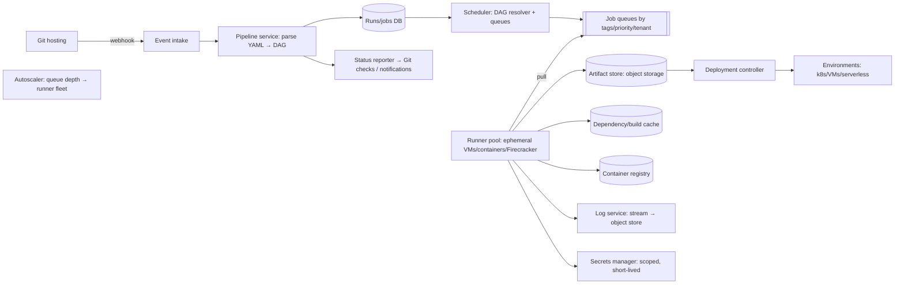

# 🛠️ Design a CI/CD Pipeline — High Level Design

<!-- nav:start -->
🏷️ **Priority:** Low · **Difficulty:** Intermediate

⬅️ Previous: [Design Job Scheduler](../Job-Scheduler/README.md) · 🏠 [Asynchronous Systems](../README.md) · ➡️ Next: [Design Monitoring and Alerting System](../Monitoring-and-Alerting/README.md)

> 📚 **Credit:** Chapter selection, ordering and question choice follow the [AlgoMaster.io System Design Interviews course](https://algomaster.io/learn/system-design-interviews/course-roadmap). This write-up was created with Claude for personal interview prep. The premium lesson text was **not** accessed or reproduced. See [CREDITS](../../CREDITS.md).
<!-- nav:end -->

> CI/CD is a **distributed job system with a DAG, sandboxed workers, artifact storage and deployment orchestration**.
> Interview themes: isolation and security of untrusted code, elastic build capacity, caching for speed, and safe rollouts.

## 1. Clarifying Requirements

| Candidate asks | Interviewer answers | Design impact |
|---|---|---|
| Scope? | CI (build/test on commits/PRs) and CD (deploy to environments). | Two stages. |
| Triggers? | Git push/PR webhooks, schedules, manual. | Event intake. |
| Scale? | 50k repos, 500k builds/day, peaks at business hours; 10M build-minutes/day. | Elastic workers. |
| Pipelines? | YAML-defined DAGs of stages/jobs with dependencies, matrix builds. | Scheduler/DAG engine. |
| Isolation? | Untrusted code (forks, PRs). | Sandboxing. |
| Artifacts/cache? | Store binaries, images, test reports; dependency caches. | Blob storage + cache. |
| Deploys? | Blue/green, canary, rollback, approvals. | Deployment controller. |
| Feedback? | Status checks on PRs, logs streaming, notifications. | Real-time logs. |

**Functional:** trigger runs, execute jobs in isolated runners, parallelise, cache/artifacts, live logs, status reporting, secrets management, deployments with strategies/approvals/rollback.
**Non-functional:** fast feedback (queue time < 30 s), reliability, security, cost-efficient elasticity, auditability.

## 2. Back-of-the-Envelope Estimation

| Quantity | Working | Result |
|---|---|---|
| Builds | 500k/day | ~6/s avg, peak ~30/s |
| Jobs per build | ~8 | 4M jobs/day, ~140/s peak |
| Concurrent runners | 10M build-min/day ÷ 1,440 ≈ 7k avg; peak ×3 | **~20k concurrent runners** |
| Logs | 4M jobs × 2 MB | 8 TB/day (compress, retain 30 d) |
| Artifacts | 500k × 100 MB (some) | ~50 TB/day ⇒ TTL/expiry |
| Cache | Dependency caches per repo/branch | PBs across tenants, tiered |

## 3. Core APIs

```http
POST /webhooks/git   (push, pull_request events; signature-verified)
POST /v1/pipelines/{id}/runs {ref, sha, variables}      GET /v1/runs/{id} → stages/jobs/status
GET  /v1/jobs/{id}/logs?follow=true                     POST /v1/runs/{id}/cancel | retry
POST /v1/deployments {app, env, artifact, strategy: canary|blue_green|rolling, approvals[]}
POST /v1/deployments/{id}/promote | rollback
Runner API (long-poll): POST /runner/jobs/request → job spec + short-lived token ; PATCH /runner/jobs/{id}/trace ; POST /runner/jobs/{id}/artifacts
```

## 4. High-Level Design



### 4.1 CI flow
Webhook → validate signature → load pipeline definition at that commit → build DAG (stages/jobs, `needs`, matrix expansion) → scheduler enqueues ready jobs (no unmet dependencies) → runners pull jobs matching their tags → clone code, restore cache,
run steps in a sandbox, stream logs, upload artifacts/test reports, save cache → report status → scheduler releases downstream jobs → run completes; statuses posted to the PR.

### 4.2 CD flow
Successful pipeline (or promotion) creates a deployment for an artifact (immutable, by digest) to an environment; controller executes strategy (rolling/canary/blue-green) with health checks and automated rollback; approvals/gates for production;
deployment records for audit.

## 5. Database Design

```text
pipelines   pipeline_id PK, repo_id, config_path, triggers, variables(encrypted refs)
runs        run_id PK, pipeline_id, sha, ref, trigger, status, created_at, finished_at      (partition by repo/time)
stages/jobs job_id PK, run_id, stage, name, needs[], tags, status(pending|queued|running|success|failed|cancelled|skipped), attempts, runner_id, started_at, finished_at, exit_code
artifacts   artifact_id, job_id, path, size, digest, storage_key, expires_at
logs        job_id → chunked log segments in object storage (+ tail in Redis for live view)
cache       key (repo, hash(lockfile), os) → blob location (object store), LRU/TTL
deployments deploy_id PK, app, env, artifact_digest, strategy, status, steps[], approvals[], started_by, timestamps
runners     runner_id, tags, capacity, state, last_seen                                  (registry with heartbeats)
audit_log   append-only events
```

## 6. Design Deep Dive

### 6.1 DAG scheduling
Represent jobs as nodes with `needs` edges; scheduler maintains counters of unmet dependencies; when zero ⇒ enqueue. Handle failure policies (`allow_failure`, `when: always`), retries with backoff for infra failures (not test failures),
matrix builds (expand to parallel jobs), fail-fast cancelling siblings, concurrency limits per repo/branch (cancel superseded runs on new pushes), priorities (default branch vs forks).

### 6.2 Runner architecture and isolation
Runners are **ephemeral** (fresh VM/microVM/container per job) to prevent cross-job contamination. Untrusted code (forked PRs) requires strong isolation: microVMs (Firecracker), gVisor, no long-lived secrets, restricted network egress,
resource limits (CPU/mem/time/disk), read-only base images. Runners pull jobs (outbound only) so they can sit behind firewalls; authenticate with short-lived tokens scoped to the job.

### 6.3 Elastic capacity and queue time
Autoscaler scales the runner fleet on queue depth/age (predictive for known peaks); warm pools of pre-booted runners cut startup from minutes to seconds; spot/preemptible instances for cost with retry on preemption; multiple regions/architectures via tags.
Fair scheduling across tenants (weighted queues) prevents one org starving others.

### 6.4 Speed: caching and parallelism
Dependency cache keyed by lockfile hash; Docker layer cache/remote build cache (Bazel-style content-addressed action cache); shallow clones and repo mirrors near runners; test sharding/splitting by historical timings; incremental builds
that only rebuild affected targets (monorepo-aware). Cache poisoning risks: separate caches per trust level (fork vs main).

### 6.5 Logs and artifacts
Runners stream logs to the log service (chunked, ordered by offset); UI tails via WebSocket/SSE from a Redis tail buffer; finished logs archived to object storage (compressed, TTL). Artifacts uploaded to object storage with digests; retention policies;
container images to a registry with immutable tags/digests.

### 6.6 Secrets and security
Secrets stored in a vault, injected only into jobs that need them (protected branches/environments), masked in logs, short-lived (OIDC federation to cloud providers instead of static keys); protect against exfiltration by PRs from forks (no secrets by default);
signed commits/provenance (SLSA), SBOMs, dependency scanning, audit logs, least-privilege deploy credentials.

### 6.7 Deployment strategies and safety
- **Rolling**: replace instances gradually with health checks.
- **Blue/green**: deploy to a parallel environment then switch traffic; instant rollback.
- **Canary**: shift a small % of traffic, watch SLO metrics (errors, latency); automatically promote/rollback.
- Gates: approvals, tests, change windows; database migrations via expand/contract; feature flags decouple deploy from release. Deployments are idempotent and recorded, with automatic rollback on failed health checks/SLO burn.

### 6.8 Reliability
Scheduler state in a durable DB; jobs have leases/heartbeats (runner dies ⇒ job requeued/marked infra-failure); idempotent status callbacks; webhook deduplication by delivery id; backpressure on burst pushes; multi-AZ control plane;
graceful degradation (queue jobs when runners unavailable), retry policies distinguishing infra vs code failures.

## 7. Follow-ups (with answers)

**7.1 How do you keep builds fast at monorepo scale?** Change detection (affected targets), remote build cache and distributed execution (Bazel-style), test sharding, warm runners, repo mirrors/shallow clones, and caching of dependencies.

**7.2 How do you securely run pull requests from forks?** Ephemeral sandboxed runners, no secrets, restricted network, read-only tokens, approval required for first-time contributors, separate caches; run privileged jobs only after merge or maintainer approval.

**7.3 How do you avoid double-running a pipeline on duplicate webhooks?** Deduplicate by webhook delivery id and `(repo, sha, trigger)` with an idempotency key; scheduler creates the run atomically.

**7.4 How does a canary deployment decide to roll back?** Compare canary vs baseline metrics (error rate, latency, saturation) over a window with statistical thresholds; auto-abort and revert traffic if exceeded.

**7.5 How do you handle a runner that dies mid-job?** Heartbeats expire ⇒ job marked failed-infra and retried on another runner (idempotent steps); partial artifacts/logs preserved; cap retries.

**7.6 How would you implement live log tailing at scale?** Runners push log chunks with sequence numbers; a log service appends to a fast store (Redis/Kafka) and object storage; viewers subscribe via SSE/WebSocket with cursor resume; large logs paginate.

## 🧪 Practice Round

<details><summary>Why do runners pull jobs instead of the scheduler pushing?</summary>
Pull works through firewalls/NAT (outbound only), naturally load-balances by capacity, and simplifies auth and autoscaling.
</details>

<details><summary>Why use ephemeral runners?</summary>
Fresh isolated environments prevent state leakage, cache poisoning and persistence of secrets between jobs, improving both reproducibility and security.
</details>

## 📝 Last-Minute Revision

Webhook → pipeline → **DAG scheduler** → queues → **ephemeral sandboxed runners (pull)** → cache/artifacts/logs; autoscale on queue age with warm pools; caches + sharding for speed; secrets via OIDC/short-lived; CD strategies (rolling/blue-green/canary) with health-gated auto-rollback; dedupe webhooks; heartbeats/leases for job reliability.

Related: [Handling Long-Running Tasks](../../05-Interview-Patterns/15-handling-long-running-tasks.md) · [Job Scheduler](../Job-Scheduler/README.md) · [Surviving Component Failures](../../05-Interview-Patterns/09-surviving-component-failures.md)
