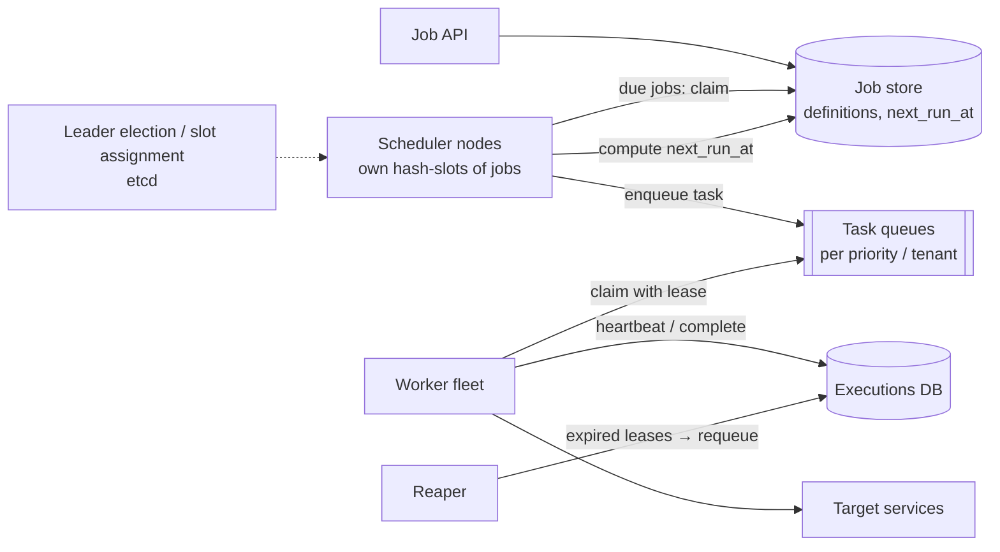

# ⏰ Design a Distributed Job Scheduler — High Level Design

<!-- nav:start -->
🏷️ **Priority:** Medium · **Difficulty:** Intermediate

⬅️ Previous: [Design Notification Service](../Notification-Service/README.md) · 🏠 [Asynchronous Systems](../README.md) · ➡️ Next: [Design CI/CD Pipeline](../CI-CD-Pipeline/README.md)

> 📚 **Credit:** Chapter selection, ordering and question choice follow the [AlgoMaster.io System Design Interviews course](https://algomaster.io/learn/system-design-interviews/course-roadmap). This write-up was created with Claude for personal interview prep. The premium lesson text was **not** accessed or reproduced. See [CREDITS](../../CREDITS.md).
<!-- nav:end -->


> "Run this at 9 a.m. every day" is trivial with cron on one machine. At millions of jobs across a
> fleet you must decide *who fires it, exactly once per tick, and what happens when that worker
> dies halfway through*.

---

## 📑 On this page

1. [Clarifying Requirements](#1-clarifying-requirements) · 2. [Estimation](#2-back-of-the-envelope-estimation) ·
3. [Core APIs](#3-core-apis) · 4. [High-Level Design](#4-high-level-design) · 5. [Database Design](#5-database-design) ·
6. [Deep Dive](#6-design-deep-dive) · 7. [Follow-ups](#7-follow-ups-with-answers)

---

## 1. Clarifying Requirements

| Candidate asks | Interviewer answers | Design impact |
|---|---|---|
| Job types? | One-off delayed + recurring (cron). | Two schedule kinds. |
| What runs? | HTTP callbacks / tasks on worker fleet. | Pluggable executors. |
| Precision? | Within a few seconds. | Poll interval / timing wheel. |
| Guarantee? | At-least-once; no missed runs. | Leases, retries. |
| Retries? | Configurable with backoff. | Retry policy per job. |
| Priorities / tenants? | Yes, isolation needed. | Separate queues. |
| Dependencies? | Simple chains later. | DAG follow-up. |
| Scale? | 10M jobs, spikes at :00. | Partitioned scheduler. |

**Functional:** create/update/pause/delete jobs, schedule (once/cron), retry, status/history, timeouts.
**Non-functional:** timely, reliable (no lost or endlessly duplicated runs), horizontally scalable,
fault tolerant, multi-tenant safe.

---

## 2. Back-of-the-Envelope Estimation

| Quantity | Working | Result |
|---|---|---|
| Jobs defined | given | 10M |
| Executions/day | 10M × ~2 avg | ~20M ⇒ **~230/s avg** |
| Peak (top of the minute/hour) | ~5% of jobs fire together | **~5–10k/s** bursts |
| Job row | ~500 B | 5 GB (small) |
| Execution history | 20M × 300 B | **~6 GB/day** ⇒ TTL 30 days |
| Due-job scan | index on `next_run_at` | cheap range scans |

---

## 3. Core APIs

```http
POST /v1/jobs      { "name":"daily-report", "schedule":{"cron":"0 9 * * *","tz":"Asia/Kolkata"},
                     "target":{"type":"http","url":"...","payload":{}}, "retry":{"max":5,"backoff":"exp"},
                     "timeout_s":300, "priority":"normal" }         → 201 { job_id }
POST /v1/jobs      { ..., "schedule":{"run_at":"2026-10-01T10:00:00Z"} }   (one-off)
PATCH /v1/jobs/{id}   (pause/resume/update)      DELETE /v1/jobs/{id}
GET  /v1/jobs/{id}/executions?limit=50           → history, statuses, attempts
Worker API:  claim(worker_id, n) → tasks[]  ·  heartbeat(task_id)  ·  complete(task_id, result)
```

---

## 4. High-Level Design



### 4.1 Requirement 1: Fire jobs on time
Scheduler nodes each own a slice of the job space (`hash(job_id) mod slots`). Every second they query
`WHERE slot IN mine AND next_run_at <= now AND state='SCHEDULED' ORDER BY next_run_at LIMIT n`,
atomically claim, create an execution `(job_id, scheduled_time)` and enqueue a task.

### 4.2 Requirement 2: Execute reliably
Workers **lease** tasks (visibility timeout), heartbeat while running, and report completion. Missing
heartbeat ⇒ lease expires ⇒ reaper requeues (at-least-once). Failures follow the retry policy, then
go to a dead-letter state with alerts.

---

## 5. Database Design

```text
jobs(job_id PK, tenant_id, name, schedule_type, cron_expr, tz, run_at, target_json, retry_json,
     priority, state, next_run_at, slot, version)         INDEX (slot, state, next_run_at)
executions(execution_id PK, job_id, scheduled_time, attempt, status, worker_id,
           lease_expires_at, started_at, finished_at, error,
           UNIQUE(job_id, scheduled_time))                   -- idempotent tick creation
```

Store: relational for job definitions (transactional claims) and a scalable KV/wide-column for the
execution history (append-heavy, TTL). Task queues: Kafka/SQS/Redis streams.

---

## 6. Design Deep Dive

### 6.1 Finding due jobs efficiently
Index `(slot, state, next_run_at)`; batch claims; for sub-second precision keep the next ~minute of
jobs in an in-memory **timing wheel** or min-heap loaded periodically. Time-bucket partitioning (by
minute) narrows scans.

### 6.2 Exactly one trigger per tick
- **Claim atomically**: `UPDATE jobs SET state='CLAIMED', version=version+1 WHERE job_id=? AND
  version=? AND next_run_at<=now` — or `SELECT ... FOR UPDATE SKIP LOCKED`.
- **Unique `(job_id, scheduled_time)`** on executions makes double-creation impossible even if two
  schedulers race or a scheduler restarts.
- Slot ownership through leader election / consistent hashing; when a scheduler dies, its slots move
  to others (claims are idempotent so overlap is safe).

### 6.3 Leases, heartbeats and idempotent jobs
Worker gets `lease_expires_at = now + T`, extends via heartbeat. Expired lease ⇒ another worker may
run the same execution, so **jobs must be idempotent** (pass `execution_id` as an idempotency key to
downstream calls). Fencing tokens prevent a zombie worker from committing late.

### 6.4 Recurring schedules
After enqueueing a run, compute the next fire time from cron + time zone (DST aware) and update
`next_run_at` in the same transaction. Missed-run policy on downtime: *run once*, *catch up all*, or
*skip*: configured per job.

### 6.5 Retries, priorities, fairness
Retry with exponential backoff + jitter via a delayed queue; separate queues per priority and
weighted consumption per tenant to prevent starvation; per-tenant concurrency caps.

### 6.6 Thundering herd at :00
Spread when possible (jitter for jobs that don't need exact times), pre-scale workers ahead of known
peaks, buffer via queues, and rate-limit target services.

---

## 7. Follow-ups (with answers)

### 7.1 Can you guarantee exactly-once execution?
Not in general. Guarantee **at-least-once** delivery plus idempotent job handlers (execution-id
dedupe) to get *effectively once*. Exactly-once would require atomically coupling the side effect
with the scheduler's state, which external systems can't participate in.

### 7.2 How do you support job dependencies (DAGs)?
Model a workflow: nodes = tasks, edges = dependencies; a workflow engine tracks state and enqueues a
task when all upstream tasks succeed; supports retries, timeouts and compensation. (Airflow/Temporal
style.) Persist workflow state durably.

### 7.3 What if a job runs longer than expected?
Timeouts cancel or kill it; heartbeats show progress; the overlap policy decides whether the next
tick starts (`allow`, `skip`, `queue`, `cancel previous`).

### 7.4 How do you scale to 100M jobs?
More slots and scheduler nodes; shard the job DB by slot; move to time-bucketed storage; keep only
the near-future window hot in memory; archive history aggressively.

### 7.5 How do you handle time zones and DST?
Store the schedule with an IANA time zone; compute next fire times using a tz-aware library; define
behaviour for skipped/repeated local times (run once at the first valid instant).

### 7.6 How do you run this across regions safely?
Each region owns a disjoint set of slots (no double firing); failover moves slot ownership through
consensus with a fencing epoch so the old region cannot keep firing after being replaced.

### 7.7 How do you monitor it?
Scheduling lag (actual − scheduled), queue age, lease expiries, retry rates, failed/dead jobs,
per-tenant usage; alert when lag exceeds SLO.

---

## 🧪 Practice Round

<details><summary>1. What prevents two schedulers from firing the same tick?</summary>
The unique `(job_id, scheduled_time)` constraint (plus an atomic claim); the loser's insert fails.
</details>

<details><summary>2. A worker hangs forever. What saves the system?</summary>
Heartbeat/lease expiry: the reaper requeues the task, an execution timeout kills the run.
</details>

---

## 📝 Last-Minute Revision

- Due-job **index scan** (or timing wheel) → atomic claim → unique `(job, tick)` → queue → workers with **leases**.
- At-least-once + idempotent handlers; retries with backoff+jitter; DLQ; overlap policy.
- Partition jobs by hash slot; leader election/consensus for ownership; fencing tokens.
- Concepts: [messaging](../../_Reference/messaging-and-streaming.md) ·
  [coordination](../../04-Technology-Deep-Dives/12-zookeeper.md) ·
  [idempotency](../../05-Interview-Patterns/10-preventing-duplicate-processing.md) ·
  [scheduling patterns](../../_Reference/realtime-and-sync-patterns.md)

---

## 📚 References & Credits

| Resource | Use |
|---|---|
| Public docs of workflow engines (Temporal, Airflow) | Concept references |
| `cron` man page / IANA tz database | Schedule semantics |

Original work; personal learning project, not affiliated with AlgoMaster.io.
