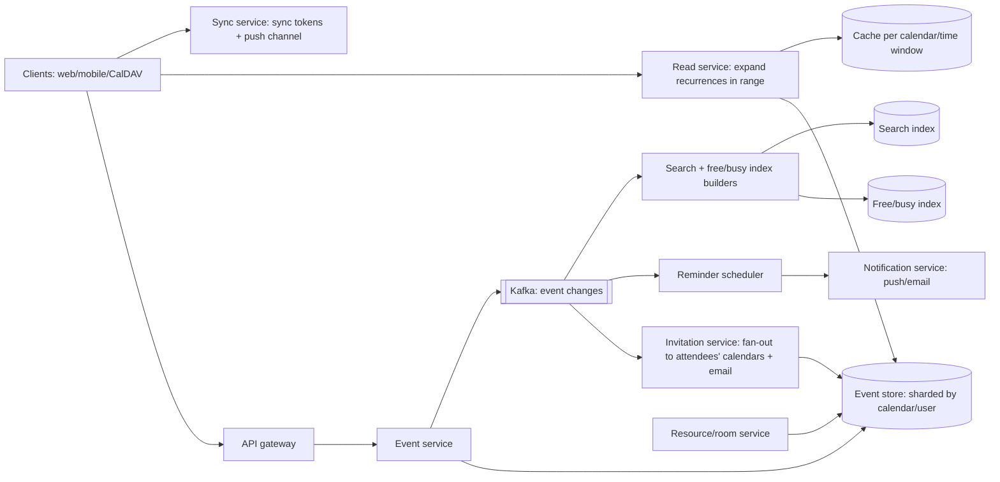

# 📅 Design a Calendar System (Google Calendar) — High Level Design

<!-- nav:start -->
🏷️ **Priority:** Low · **Difficulty:** Advanced

⬅️ Previous: [Design LeetCode](../LeetCode/README.md) · 🏠 [Specialized Systems](../README.md) · ➡️ Next: [Design Online Chess](../Online-Chess/README.md)

> 📚 **Credit:** Chapter selection, ordering and question choice follow the [AlgoMaster.io System Design Interviews course](https://algomaster.io/learn/system-design-interviews/course-roadmap). This write-up was created with Claude for personal interview prep. The premium lesson text was **not** accessed or reproduced. See [CREDITS](../../CREDITS.md).
<!-- nav:end -->

> A calendar looks trivial until you meet **recurring events, time zones, daylight saving, invitations, free/busy lookups and sync across
> devices**. The right data model for recurrence is the heart of the design.

## 1. Clarifying Requirements

| Candidate asks | Interviewer answers | Design impact |
|---|---|---|
| Features? | Create/edit/delete events, recurrence, reminders, invitations/RSVP, multiple calendars, sharing, free/busy, meeting-room booking. | Broad scope. |
| Recurrence? | Daily/weekly/monthly/custom (RRULE), exceptions ("this event only"). | Rule-based storage. |
| Time zones? | Yes; events keep zone semantics; DST correct. | tz-aware model. |
| Scale? | 500M users, 5B events, 50M DAU, 1B event reads/day. | Read heavy. |
| Sync? | Web/mobile/desktop + CalDAV/iCal; near real time. | Sync tokens/push. |
| Notifications? | Reminders at N minutes before; invitation emails. | Scheduler. |
| Consistency? | Own edits immediate; invitee views within seconds. | Eventual across users. |
| Conflicts? | Warn on overlaps; room double-booking prevented. | Constraints for rooms. |

**Functional:** CRUD events and recurrences, attendees + RSVP, reminders/notifications, multiple/shared calendars, free/busy queries, room/resource booking, search, sync.
**Non-functional:** correctness across time zones/DST, low latency month/week views, high availability, strong per-event consistency, scalable fan-out to attendees.

## 2. Back-of-the-Envelope Estimation

| Quantity | Working | Result |
|---|---|---|
| Events | 500M users × 10 events avg (series counted once) | **5B event records** × 1 KB ≈ 5 TB |
| Instances | Recurring series expand infinitely: don't store instances | store rules + exceptions |
| Reads | 50M DAU × 20 views | 1B/day ≈ **11.6k/s**, peak 40k/s |
| Writes | 50M DAU × 0.5 edits | 300/s (invites multiply ~×5 fan-out) |
| Reminders | 10% of events with reminder; ~200M reminders/day | ~2.3k/s avg, spikes on the hour |
| Free/busy | meeting scheduling queries across many attendees | fan-in reads |

## 3. Core APIs

```http
POST /v1/calendars/{cal}/events {title, start:{dateTime,timeZone}, end, recurrence:["RRULE:FREQ=WEEKLY;BYDAY=MO,WE"],
                                 attendees[], reminders[], location, visibility}        → 201 {event_id, etag}
GET  /v1/calendars/{cal}/events?timeMin=..&timeMax=..&singleEvents=true            → expanded instances in range
PATCH /v1/calendars/{cal}/events/{id}?scope=this|following|all  {…}   (If-Match: etag)
POST /v1/events/{id}/respond {status: accepted|declined|tentative}
POST /v1/freebusy {users[], timeMin, timeMax}      → busy intervals per user
GET  /v1/sync?syncToken=…                          → changes since token  (push via webhooks/WebSocket)
```

## 4. High-Level Design



### 4.1 Write path
Validate (rule syntax, time zones, ACL), write the event with an ETag/version, and publish a change event. Invitation service creates/updates **attendee copies** (or references) in each invitee's calendar and sends notifications; RSVP updates the organiser's view.
Reminder scheduler registers/upserts reminders.

### 4.2 Read path (view a week)
Fetch **events overlapping the range** for the calendars shown: single events by interval index; for recurring series, expand the RRULE within the window (applying exceptions) on the fly (or from a bounded materialised cache), merge and return. Cache by `(calendar, window, version)`.

## 5. Database Design

```text
events   PK (calendar_id, event_id) → title, description, start_utc, end_utc, start_tz (IANA), all_day, rrule, exdates[], recurrence_master_id?,
         original_start (for exceptions), organiser, visibility, etag, version, updated_at
         -- single events: (calendar_id, start_utc) index for range queries (time-bucketed partitions)
         -- recurring series: one master row + exception rows (modified/cancelled instances)
attendees (event_id, user_id) → response_status, role, notified_at; reverse index (user_id, event_id) to show invited events
calendars calendar_id, owner, tz, acl(list of principals, roles), color
reminders (fire_at_utc, event_id, instance_start, method) → scheduler store
free/busy (user_id, day_bucket) → merged busy intervals (bitmap/interval list), updated on changes
sync      per-calendar change log: (calendar_id, seq) → event_id, op; sync token = seq
resources rooms(resource_id, capacity, calendar_id); bookings enforce non-overlap via unique/exclusion constraint
```

## 6. Design Deep Dive

### 6.1 Recurrence model
Store the **rule** (RFC 5545 RRULE: `FREQ=WEEKLY;BYDAY=MO,WE;UNTIL=...`), start time and time zone, not every occurrence (infinite series). To answer a range query, **expand** the rule within `[from, to)` using a library, subtract `EXDATE`s, and overlay
**exception instances** (edited/cancelled occurrences identified by `original_start`). Editing scope: *this event* ⇒ create an exception; *this and following* ⇒ split the series (truncate old `UNTIL`, create a new master); *all* ⇒ edit the master.
Bound expansion (max horizon, max instances) and cache expansions.

### 6.2 Time zones and DST
Store `start` as local time + IANA tz (e.g. `Asia/Kolkata`, `America/New_York`) for recurring events so "9:00 every Monday" stays at 9:00 local across DST changes; also keep UTC for the first instance and for indexing single events. Expand rules in local time then convert to UTC using
tz database rules (handle nonexistent/ambiguous local times). Keep tz database versions updated; attendees see events converted into their own zones. All-day events are date-based (floating), not instants.

### 6.3 Invitations and attendee state
Options: each attendee has a **copy** of the event (fast reads, per-user overrides such as colour/reminders, offline sync) or a **reference** to the organiser's event (single source of truth). Common approach: per-attendee row linked to the master event id;
organiser updates propagate via events to attendee rows (eventually consistent); RSVP updates flow back and update the organiser's view. External attendees via iTIP/email (iCalendar invites with `.ics`, handle replies).

### 6.4 Reminders at scale
Reminder = `(fire_at_utc, event_id, instance)`. For recurring events, materialise reminders only for the **next occurrence(s)** (e.g. within 24–48 h), regenerate as time passes; store in a time-bucketed scheduler (see
[Scheduling Delayed and Recurring Jobs](../../05-Interview-Patterns/16-scheduling-delayed-and-recurring-jobs.md)); the "top of the hour" spike is handled by queues and jitter; deliver via [Notification Service](../../17-Asynchronous-Systems/Notification-Service/README.md); dedupe with `(event, instance, method)` keys;
edits/deletes cancel or reschedule affected reminders.

### 6.5 Free/busy and scheduling assistant
Maintain per-user **busy interval index** (merged intervals per day or bitmap of 15-min slots) updated from event changes; `freebusy` queries fetch indices for many users and intersect to suggest common free slots (respect visibility: only busy/free, not titles, for others).
Working hours, time zones, and preferences applied at query time. Large groups: hierarchical/batched fetch and caching.

### 6.6 Room/resource booking (no double-booking)
Resources have calendars; booking inserts an event with an **exclusion constraint** on `(resource_id, time range)` (e.g. Postgres `EXCLUDE USING gist`) or optimistic conditional writes; approve/decline flow; recurring room bookings check all instances (bounded horizon).
See [Preventing Double Booking](../../05-Interview-Patterns/14-preventing-double-booking.md).

### 6.7 Sync across devices
Per-calendar **change log with sequence numbers**; clients keep a `syncToken`; `GET /sync?token` returns changes since; if the token is too old return full resync. Push notifications (webhooks/WebSocket/FCM) tell devices to sync. ETags/`If-Match` avoid lost updates;
conflict on concurrent edits ⇒ last-writer-wins by version with 412 Precondition Failed to retry/merge. CalDAV compatibility layer maps to the same model.

### 6.8 Sharding and scale
Shard by **calendar_id/user_id** (locality for month view); big shared calendars (company holidays, public calendars) are read-mostly and cached/replicated; range queries by time index within a shard; cross-user operations (free/busy) fan-out to several shards
with caching and precomputed indexes.

## 7. Follow-ups (with answers)

**7.1 How do you store "every weekday at 9 am forever" without infinite rows?** Store a single rule with an RRULE, expand only for the requested window at read time, with exceptions stored separately.

**7.2 How do you handle "edit this and all following events"?** Split the series: set `UNTIL` on the original master to just before the chosen instance, and create a new master starting there with the modified fields (preserving earlier history).

**7.3 How do you make daylight saving time changes correct?** Keep recurring events in local time + IANA zone and convert to UTC per occurrence using the tz database, rather than storing fixed UTC offsets.

**7.4 How do you find a time when 10 people are free?** Fetch each person's busy intervals (index), merge, invert to free slots within working hours across their time zones, rank candidate slots, and cache for the requested window.

**7.5 How do you keep an invitee's calendar in sync when the organiser edits?** Change events fan out to attendee rows/copies via the invitation service; each attendee's sync log gets a new entry so all their devices update.

**7.6 How do you prevent double-booking a meeting room?** A database constraint on `(room_id, time range)` (exclusion constraint or unique slot rows) evaluated in the same transaction as the booking insert; recurring bookings validated for each instance within the horizon.

## 🧪 Practice Round

<details><summary>Why store the IANA time zone instead of a UTC offset?</summary>
Offsets change with daylight saving; a zone id encodes the rules, so recurring local-time events stay correct.
</details>

<details><summary>Why not materialise all future instances?</summary>
Series can be infinite and edits to the rule would require rewriting many rows; expanding on read from a compact rule is cheaper and simpler.
</details>

## 📝 Last-Minute Revision

Events with **RRULE + exceptions + tz-aware local start**; expand on read within a range; attendee rows synced via change events; reminders materialised only for the next occurrences (time-bucketed scheduler); free/busy interval index; rooms via **exclusion constraints**; sync with change-log tokens + ETags; shard by calendar.

Related: [Scheduling Delayed and Recurring Jobs](../../05-Interview-Patterns/16-scheduling-delayed-and-recurring-jobs.md) · [Preventing Double Booking](../../05-Interview-Patterns/14-preventing-double-booking.md) · [Notification Service](../../17-Asynchronous-Systems/Notification-Service/README.md)
