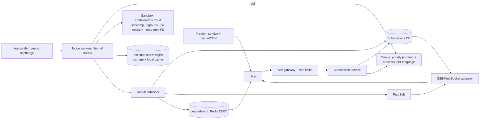

# 💻 Design LeetCode (Online Judge) — High Level Design

<!-- nav:start -->
🏷️ **Priority:** Medium · **Difficulty:** Intermediate

⬅️ Previous: [Design Monitoring and Alerting System](../../17-Asynchronous-Systems/Monitoring-and-Alerting/README.md) · 🏠 [Specialized Systems](../README.md) · ➡️ Next: [Design Calendar System](../Calendar-System/README.md)

> 📚 **Credit:** Chapter selection, ordering and question choice follow the [AlgoMaster.io System Design Interviews course](https://algomaster.io/learn/system-design-interviews/course-roadmap). This write-up was created with Claude for personal interview prep. The premium lesson text was **not** accessed or reproduced. See [CREDITS](../../CREDITS.md).
<!-- nav:end -->

> An online judge **runs strangers' code**. The system design boils down to three things: a safe **sandbox**, an elastic **execution queue**,
> and a **live contest** mode where thousands submit at the same instant.

## 1. Clarifying Requirements

| Candidate asks | Interviewer answers | Design impact |
|---|---|---|
| Core flow? | Browse problems, write code, run samples, submit against hidden tests, get verdict. | Execution service. |
| Languages? | ~15 (C++, Java, Python, Go, ...). | Language runners. |
| Limits? | Time/memory per test case; total 10 s. | Resource limits. |
| Contests? | Weekly contests: 50k participants, submissions spike at start/end, live leaderboard. | Burst handling. |
| Security? | Untrusted code must not escape or abuse the platform. | Strong sandbox. |
| Feedback? | Verdict (AC/WA/TLE/MLE/RE/CE), runtime, memory, failing test case (sample only). | Result pipeline. |
| Scale? | 5M users, 1M submissions/day; contest peak 500 submissions/s. | Queue + autoscale. |

**Functional:** problem catalogue/search, code editor, run with custom input, submit, verdict and stats, submission history, contests with rankings, discussions (out of scope).
**Non-functional:** security/isolation, correctness and determinism of judging, low queue latency, elasticity, fairness, high availability of contests.

## 2. Back-of-the-Envelope Estimation

| Quantity | Working | Result |
|---|---|---|
| Submissions | 1M/day | **~12/s avg**, contest peak **~500/s** |
| Execution cost | 50 tests × ~0.2 s avg = ~10 s CPU per submission (worst case 60 s) | avg **~10 CPU-s** |
| Contest peak compute | 500/s × 10 CPU-s | **5,000 CPU cores** busy |
| Fleet | 5k cores ⇒ ~300 nodes of 16 vCPU (with overhead) | autoscaled |
| Storage | Test cases 1 MB × 3k problems; submissions 5 KB × 1M/day = 5 GB/day | small |
| Leaderboard | 50k users × updates | trivial for Redis |

## 3. Core APIs

```http
GET  /v1/problems?tag=dp&difficulty=medium&cursor=      GET /v1/problems/{slug}
POST /v1/problems/{id}/run     {language, code, custom_input}  → 202 {run_id}      (samples/custom only)
POST /v1/problems/{id}/submit  {language, code, contest_id?}    → 202 {submission_id}
GET  /v1/submissions/{id}      → {status: QUEUED|RUNNING|ACCEPTED|WRONG_ANSWER|TLE|MLE|RE|CE, runtime_ms, memory_kb, failed_case?}
SSE  /v1/submissions/{id}/events (or polling)
GET  /v1/contests/{id}/leaderboard?cursor=
```

## 4. High-Level Design



### 4.1 Submit flow
API validates size/rate limits, stores the submission (`QUEUED`), enqueues a job (by language and priority). A judge worker pulls the job, compiles and runs the code in a sandbox per test case, compares outputs (or runs a special checker),
records verdict + resource usage, updates DB, publishes an event; UI gets the update via SSE/poll.

### 4.2 Contest mode
Contest queue has priority and reserved capacity; leaderboard updates incrementally on accepted submissions (score = solved problems, penalty time); everyone sees near-real-time ranks; a pre-scaled worker pool handles the spike.

## 5. Database Design

```text
problems     problem_id PK, slug, title, statement, difficulty, tags[], time_limit_ms, memory_limit_mb, checker_type, tests_ref
testcases    (problem_id, case_id) → input_ref, expected_ref (object storage; hidden), weight, is_sample
submissions  submission_id PK, user_id, problem_id, contest_id?, language, code_ref/inline, status, runtime_ms, memory_kb, failed_case, created_at
             INDEX (user_id, created_at DESC), (problem_id, created_at)
contests     contest_id PK, start, end, problems[], rules(penalty, scoring)
standings    Redis ZSET contest:{id}:board → user (score, penalty encoded) ; per-user solved-map hash
users/stats  solved counts, acceptance rates (async aggregates)
```

## 6. Design Deep Dive

### 6.1 Sandboxing (the core security problem)
Layered defence for untrusted code:
- **Isolation**: containers hardened with **seccomp** (syscall allow-list), **namespaces** (PID, mount, network, IPC, user), **cgroups** (CPU, memory, pids, IO limits); or stronger **gVisor/Firecracker microVMs**.
- **No network**, read-only root filesystem, tiny writable tmpfs, no access to host/other jobs, dropped capabilities, non-root user.
- **Limits**: wall-clock and CPU time (kill on TLE), memory (OOM ⇒ MLE), output size cap (prevent log floods), process/thread caps (fork bombs), file size/open-file limits.
- **Ephemeral per run**: new sandbox per submission (or pool reset) to prevent cross-contamination; workers run on dedicated, minimally privileged nodes; monitor for escapes.

### 6.2 Judging correctness and fairness
- Compile step (with its own limits) then run per test case; compare stdout with expected using exact/tolerant comparison or a **special judge** program for problems with multiple valid answers.
- **Deterministic timing**: pin to CPU cores, avoid noisy neighbours, measure CPU time not wall time, scale limits by language (e.g. ×2 for Python/Java), run TLE-borderline cases again; warm JVMs cautiously.
- Stop at first failure (or run all for scoring); reveal failing input only for samples; hide hidden test data.
- Detect plagiarism/cheating offline (similarity tools) for contests.

### 6.3 Queueing, scaling and priority
Separate queues per priority class (contest > premium > free) and per language image; workers pull (capacity-aware); autoscale on queue age with pre-scaling before contest start; warm pool of sandboxes/container images cached on nodes;
preemption/timeouts for hung jobs; idempotent job processing (dedupe by submission id, results written once); poison-code handling (repeated worker crashes ⇒ mark as RE/system error).

### 6.4 Test-case and image distribution
Test data stored in object storage, cached on worker SSDs (LRU) and prefetched for contest problems; language runtime images pre-pulled; large inputs streamed via files (not command line).

### 6.5 Results and real-time UX
Persist verdict, publish via pub/sub to the user's SSE stream; poll fallback; for contests avoid stampedes by rate-limiting polling; store last N submissions per user in cache; run-code (custom input) uses the same pipeline with a smaller/faster path and stricter quotas.

### 6.6 Leaderboard and contest correctness
On accepted submission compute score/penalty (`solve_time + 5 min × wrong attempts`); update Redis ZSET with composite score for ordering; handle rejudge/void submissions by recomputation; freeze leaderboard at the last minutes optionally;
final results computed authoritatively from the submission DB after the contest.

### 6.7 Abuse and cost controls
Rate limits per user/IP (run and submit), CAPTCHA for suspicious usage, quotas on concurrent executions, detect crypto-mining/abuse patterns via resource profiling, kill switches per language/problem.

### 6.8 Reliability and rejudging
Submissions immutable (code stored); ability to **rejudge** all submissions after fixing test data/checkers (replay jobs at low priority); multi-AZ workers; contest failover plan (extra reserved capacity, read-only mode fallback).

## 7. Follow-ups (with answers)

**7.1 How do you stop a user from reading the hidden test cases?** Tests are never mounted into the user's sandbox in readable form: the judge feeds input via stdin/pipe and compares output outside the sandbox; the sandbox has no filesystem access to test data and no network.

**7.2 How do you handle a contest with 50k users all submitting at once?** Pre-scale workers, prioritised queues, back-pressure with clear "queued" status, cached test data, batch DB writes, and rate limits; results asynchronous via SSE.

**7.3 How do you make time limits fair across languages and machines?** Measure CPU time in pinned, homogeneous worker classes, apply per-language multipliers, calibrate with reference solutions, and rerun borderline TLEs.

**7.4 What if a submission crashes the worker or escapes limits?** Supervisor kills the sandbox on limit breach, worker health checks, isolate workers per job, and treat repeated failures as system errors and alert security; keep workers disposable.

**7.5 How do you support problems with multiple correct answers?** Provide a custom **checker program** (validator) that reads input, contestant output and reference and decides correctness.

**7.6 How would you add interactive problems?** Judge runs the contestant program and an interactor connected via pipes with strict limits on total interaction and time; the interactor verdict determines result.

## 🧪 Practice Round

<details><summary>Why no network inside the sandbox?</summary>
Prevents data exfiltration, attacks on internal services and abuse (mining, DDoS); all I/O is via controlled pipes.
</details>

<details><summary>Why judge with CPU time rather than wall time?</summary>
Wall time varies with machine load and scheduling; CPU time is a more stable measure of the program's own work.
</details>

## 📝 Last-Minute Revision

Submit → DB + priority queue → **pull-based judge workers** → hardened sandbox (seccomp, namespaces, cgroups, no network, gVisor/Firecracker) → compile/run per test with limits → verdict → SSE; contests: pre-scale + priority + Redis leaderboard; test data isolation; special judges; rejudging; rate limits.

Related: [Handling Long-Running Tasks](../../05-Interview-Patterns/15-handling-long-running-tasks.md) · [Real Time Leaderboard](../../16-Counting-and-Ranking-Systems/Real-Time-Leaderboard/README.md) · [CI/CD Pipeline](../../17-Asynchronous-Systems/CI-CD-Pipeline/README.md)
