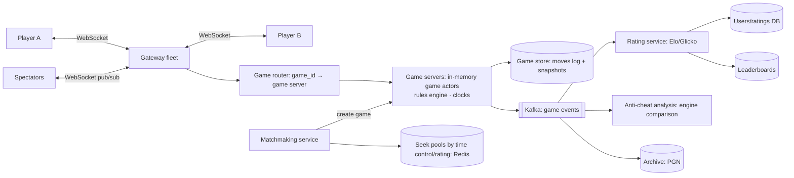

# ♟️ Design Online Chess — High Level Design

<!-- nav:start -->
🏷️ **Priority:** Low · **Difficulty:** Advanced

⬅️ Previous: [Design Calendar System](../Calendar-System/README.md) · 🏠 [Specialized Systems](../README.md) · ➡️ Next: *(end)*

> 📚 **Credit:** Chapter selection, ordering and question choice follow the [AlgoMaster.io System Design Interviews course](https://algomaster.io/learn/system-design-interviews/course-roadmap). This write-up was created with Claude for personal interview prep. The premium lesson text was **not** accessed or reproduced. See [CREDITS](../../CREDITS.md).
<!-- nav:end -->

> A two-player, turn-based, **real-time game**: the server is the referee (validates every move), matchmaking pairs players of similar skill,
> clocks must be trustworthy, and games must survive disconnects. (Object model: LLD repo's *Chess*.)

## 1. Clarifying Requirements

| Candidate asks | Interviewer answers | Design impact |
|---|---|---|
| Modes? | Live games with time controls (bullet/blitz/rapid), casual and rated; daily (correspondence) later. | Clock handling. |
| Matchmaking? | By rating and time control, quickly. | Matching queue. |
| Rules? | Full chess rules validated server-side; draw/resign/offer. | Server authority. |
| Real time? | Moves delivered < 100 ms; spectators and live boards. | WebSocket. |
| Scale? | 10M DAU, 500k concurrent games peak, 100k moves/s. | Many small sessions. |
| Ratings? | Elo/Glicko after each rated game. | Post-game pipeline. |
| Reliability? | Reconnects; no game lost on server failure. | Persistence + resume. |
| Fair play? | Cheat detection (engine use). | Async analysis. |

**Functional:** play (create/join via matchmaking or challenge), make moves with clocks, resign/draw offer, spectate, game history/replay (PGN), ratings/leaderboards, chat, anti-cheat, puzzles/analysis (optional).
**Non-functional:** low latency, correctness of rules and clocks, resilience to disconnects, fairness, scalability to hundreds of thousands of concurrent games.

## 2. Back-of-the-Envelope Estimation

| Quantity | Working | Result |
|---|---|---|
| Concurrent games | 500k × 2 players | **1M WebSocket connections** (+ spectators) |
| Moves | avg 1 move per ~10 s per game | **~50k moves/s** aggregate (peaks 100k) |
| Message size | ~100 B | ~10 MB/s — small |
| Game state | 1 KB in memory | 500 MB total ⇒ trivial |
| Games/day | 20M × ~1.5 KB PGN | 30 GB/day persistent |
| Matchmaking | 100k players/min | in-memory pools |

## 3. Core APIs

```http
POST /v1/seek {time_control:"5+3", rated:true, rating_range:[±100]}   → 202 {ticket_id}
WS   /ws/games/{game_id}
       → {type:"move", uci:"e2e4", move_no, client_ts}       ← {type:"move", san:"e4", fen, clocks:{w:298.1,b:300.0}, seq}
       → {type:"resign"|"offer_draw"|"accept_draw"|"abort"}   ← {type:"game_over", result:"1-0", reason:"checkmate"}
GET  /v1/games/{id}   (PGN + metadata)   GET /v1/users/{id}/games?cursor=   GET /v1/leaderboard?perf=blitz
```

## 4. High-Level Design



### 4.1 Making a move
Client sends the move (with sequence number); the **game actor** (single-threaded per game on one server) validates turn, legality via the rules engine, updates board state, adjusts clocks (server time), appends to the move log (durable), and broadcasts the new state
to both players and spectators; result acked with updated clocks.

### 4.2 Matchmaking
Players post seeks (time control, rated/casual, rating range); matchmaking service maintains pools keyed by `(time_control, rated)` with sorted rating structures; pairs the closest compatible ratings quickly, widening the acceptable range over waiting time; creates the game on a game server
and notifies both players (with colours assigned).

## 5. Database Design

```text
games       game_id PK, white_id, black_id, time_control, rated, start_ts, end_ts, result, termination, pgn, ply_count      (Cassandra/SQL sharded by game_id)
game_moves  (game_id, ply) → move, fen_after?, elapsed_ms, clock_after     (append-only; source of truth for recovery)
users       user_id, name, ratings{bullet,blitz,rapid}, rd/volatility (Glicko), created_at
user_games  (user_id, end_ts DESC) → game_id              (history index)
seek pools  Redis ZSET pool:{tc}:{rated} → user_id score=rating ; ticket hashes
live state  in-memory actor: board (FEN/bitboards), clocks, turn, draw offers, connections; snapshotted periodically to Redis/DB
```

## 6. Design Deep Dive

### 6.1 Server-authoritative game state
The server validates every move (legal, right player's turn, game not over); clients are untrusted. Board representation: bitboards or array; rules engine handles castling, en passant, promotion, check/checkmate/stalemate, 50-move rule, threefold repetition, insufficient material.
The move log (`game_moves`) is the source of truth: state is reconstructable by replaying moves.

### 6.2 Clocks (the tricky part)
Use **server time only**. On each move, deduct elapsed time since the opponent's move was delivered plus **latency compensation** (measured RTT, capped) and apply increment. Flag detection via a server timer scheduled at `now + remaining time` (cancelled/rescheduled per move);
client clocks are display-only, synchronised from server timestamps. Handle disconnects: clock keeps running (with a grace period/abort rule before first moves). Store clock snapshots with each move.

### 6.3 Real-time connections and routing
Each game is owned by one **game server** (consistent hashing on game_id; sticky routing via router or connection-side registry). Both players' WebSocket connections are terminated at gateways that forward frames to the owner server (or connect directly).
Spectators subscribe to a game channel via pub/sub (fan-out to potentially thousands for top games; throttle/coalesce updates for spectators).

### 6.4 Failure handling and reconnects
Every move is persisted (append to log) before/along with broadcast so a crash loses at most in-flight input; on game server failure another server loads the game from the log/snapshot, resumes clocks from stored timestamps and reconnects players (clients auto-reconnect with backoff and resync by `seq`).
Idempotency via move sequence numbers (duplicate/late messages ignored). Player disconnects: allow reconnect within grace, auto-loss/abandon rules after timeouts.

### 6.5 Matchmaking details
Pools per time control; nearest-rating search with expanding window over time (e.g. ±50 → ±200); avoid repeat pairings; prefer low wait time for bullet; handle rating provisional players; batched matching every ~1–2 s using sorted sets. Challenges (direct invites) skip pools.
Tournaments/arena modes add pairing engines and standings with a Redis leaderboard.

### 6.6 Ratings and post-game processing
Emit `GameFinished` (idempotent by game_id); rating service updates Elo/Glicko-2 for both players atomically (transaction on both user rows with version checks); leaderboards updated; history indexes written; achievements/notifications triggered; all via events so game servers stay lightweight.

### 6.7 Anti-cheat and fair play
Server compares player moves with top engine lines (accuracy, centipawn loss statistics, timing patterns), flags suspicious accounts for review; rate limits and device/IP signals; ban workflow; never send engine-relevant hints to clients; analysis runs asynchronously on finished games (GPU/CPU worker pool).

### 6.8 Scale-out
Games are independent, so shard by game_id; add game servers behind the router; keep hot state in memory; use Redis for pools and presence; per-region clusters to minimise latency (matchmaking prefers same region); autoscale on connection count and CPU.

## 7. Follow-ups (with answers)

**7.1 How do you prevent clients from cheating on time?** Only server clocks matter; the server timestamps move arrival, compensates modest latency, and enforces flag timeouts with server timers; client-provided timestamps are ignored or used only for diagnostics.

**7.2 What if the game server crashes mid-game?** A new server loads the game from the persisted move log/snapshot, restores clocks based on stored timestamps and crash time (often freezing the clock briefly), and players reconnect and resync by sequence number.

**7.3 How do you handle a spectator audience of 50,000?** Publish state updates via pub/sub to edge relays, coalesce updates (moves are infrequent), serve the current position via a cached snapshot endpoint, and send only deltas afterwards.

**7.4 How would you support correspondence (days-per-move) games?** Persist state in the DB, no live server needed; use timers per move deadline via a scheduler; notify players by push/email; identical rules engine on demand.

**7.5 How do you implement draw offers and takebacks?** Additional message types in the game actor state machine with expiry; opposing player's accept/decline resolves; sequence numbers keep them ordered with moves.

**7.6 How do you avoid double-processing the same move?** Client sends `move_no`/sequence; the actor accepts only the expected next number; duplicates return the current state.

## 🧪 Practice Round

<details><summary>Why one game actor per game?</summary>
A game is inherently sequential; a single-threaded owner gives ordering and consistency without locks, and thousands of small actors scale horizontally.
</details>

<details><summary>Why persist moves rather than the board?</summary>
The append-only move log is compact, auditable (PGN/replay), and sufficient to rebuild the board and clocks after failures.
</details>

## 📝 Last-Minute Revision

WebSocket gateways → **game actor per game on one server** (rules validation, server clocks, move log persisted) → pub/sub to spectators; matchmaking pools by time control/rating with expanding window; Kafka → Elo/Glicko, leaderboards, anti-cheat; recover from move log; server-time-only clocks with latency compensation.

Related: [Pushing Real-time Updates](../../05-Interview-Patterns/05-pushing-realtime-updates.md) · [Real Time Leaderboard](../../16-Counting-and-Ranking-Systems/Real-Time-Leaderboard/README.md) · [WhatsApp](../../08-Real-Time-Communication/WhatsApp/README.md)
